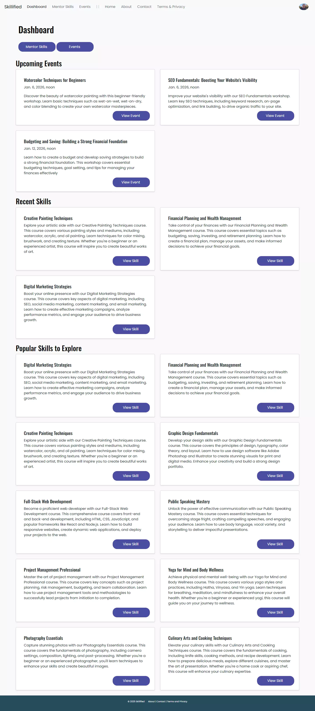
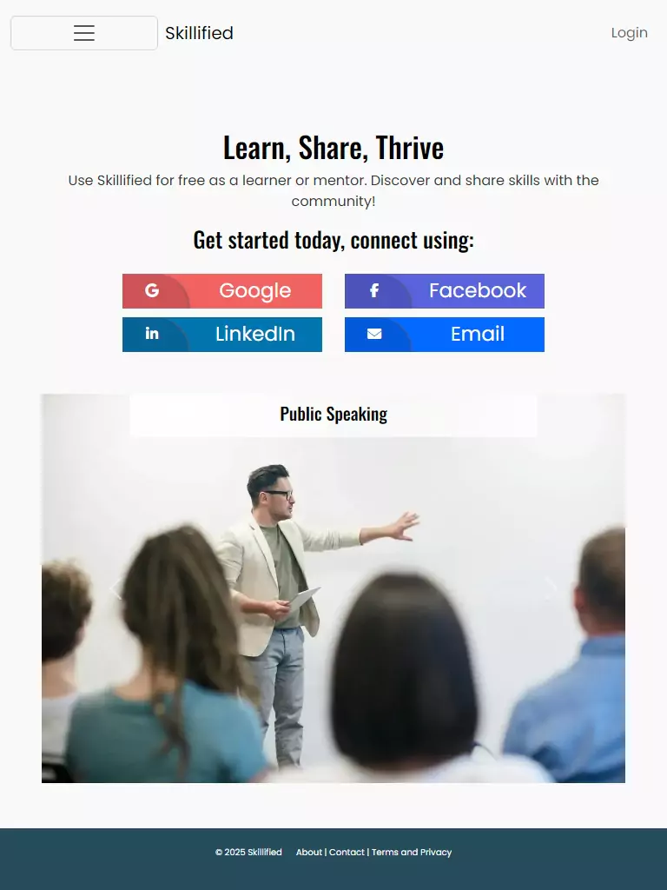
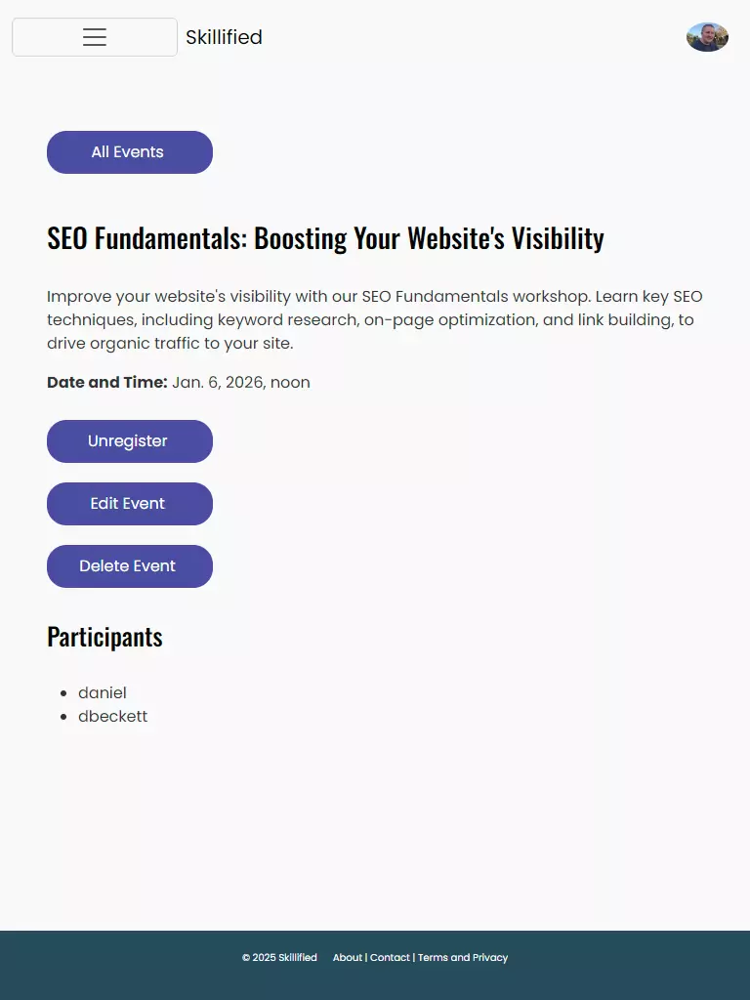

# Skillified


## Overview

Skillified is a community skill-sharing platform designed to connect individuals eager to learn and share skills. Whether it's professional expertise, personal hobbies, or unique talents, Skillified provides a collaborative environment to foster growth and exchange knowledge. The platform addresses the need for accessible, inclusive, and user-friendly learning opportunities while showcasing the potential of modern full-stack web development.

## UX Design Process

### User Stories
- As a user, I want to be able to create an account so that I can access the platform's features.
- As a user, I want to be able to log in and log out so that my account is secure.
- As a user, I want to be able to create and edit my profile so that I can share information about myself.
- As a user, I want to be able to browse and search for skills so that I can find skills I am interested in.
- As a user, I want to be able to join events related to skills I am interested in so that I can learn and share knowledge.
- As a user, I want to be able to create and manage events so that I can share my skills with others.

For more details, visit the [project page](https://github.com/users/dbeckett93/projects/9/views/1).

### Wireframes

Given that the project design was intended to utilise Bootstrap from the outset, only mobile wireframes were developed. This is because Bootstrap inherently manages most aspects of responsiveness.

<details>
<summary>Click here to view the main site page wireframes</summary>

</details>

<details>
<summary>Click here to view the user pages wireframes</summary>

</details>

<details>
<summary>Click here to view the skills & events wireframes</summary>

</details>

## ERD

#### User

| Field      | Type                   | Relationship                |
|------------|------------------------|-----------------------------|
| `id`       | Integer (Primary Key)  |                             |
| `username` | CharField              |                             |
| `email`    | EmailField             |                             |
| `password` | CharField              |                             |
| `first_name` | CharField            |                             |
| `last_name`  | CharField            |                             |
| `profile`  | OneToOneField          | Profile (One-to-One)        |
| `events`   | ManyToManyField        | Event (Many-to-Many)        |

#### Profile

| Field           | Type                  | Relationship                |
|-----------------|-----------------------|-----------------------------|
| `id`            | Integer (Primary Key) |                             |
| `user`          | OneToOneField         | User (One-to-One)           |
| `profile_picture` | CloudinaryField     |                             |
| `about_me`      | TextField             |                             |
| `facebook_link` | URLField              |                             |
| `linkedin_link` | URLField              |                             |
| `skills`        | ManyToManyField       | Skill (Many-to-Many)        |
| `is_mentor`     | BooleanField          |                             |

#### Skill

| Field       | Type                   | Relationship                |
|-------------|------------------------|-----------------------------|
| `id`        | Integer (Primary Key)  |                             |
| `name`      | CharField              |                             |
| `description` | TextField            |                             |
| `created_at` | DateTimeField         |                             |
| `updated_at` | DateTimeField         |                             |
| `profiles`  | ManyToManyField        | Profile (Many-to-Many)      |
| `events`    | ForeignKey             | Event (One-to-Many)         |

#### Event

| Field        | Type                   | Relationship                |
|--------------|------------------------|-----------------------------|
| `id`         | Integer (Primary Key)  |                             |
| `title`      | CharField              |                             |
| `overview`   | TextField              |                             |
| `date_time`  | DateTimeField          |                             |
| `skill`      | ForeignKey             | Skill (Many-to-One)         |
| `participants` | ManyToManyField      | User (Many-to-Many)         |
| `owner`      | ForeignKey             | User (Many-to-One)          |

#### NotificationSetting

| Field       | Type                   | Relationship                |
|-------------|------------------------|-----------------------------|
| `id`        | Integer (Primary Key)  |                             |
| `user`      | ForeignKey             | User (Many-to-One)          |
| `new_message` | BooleanField         |                             |
| `new_event` | BooleanField           |                             |
| `new_skill` | BooleanField           |                             |

### Relationships Summary
- User has a one-to-one relationship with Profile.
- User has a many-to-many relationship with Event (as participants).
- Profile has a many-to-many relationship with Skill.
- Skill has a one-to-many relationship with Event.
- Event has a many-to-many relationship with User (as participants).
- NotificationSetting has a many-to-one relationship with User.

## Agile Development Process

### GitHub Projects

GitHub Projects was utilised to record user stories and design tasks throughout the project development. This tool provided a structured and organised way to manage the workflow, ensuring that all tasks were tracked and completed efficiently.

### Iterative Design

An iterative design approach was adopted to build out the application. Initial wireframe designs served as a guide, allowing for continuous refinement and improvement of the user interface and user experience. This approach ensured that the application evolved based on feedback and testing results.

### Simultaneous Development and Testing

Pages and unit tests were developed simultaneously to ensure that each section of the application was thoroughly tested before moving on to the next. This practice helped in identifying and resolving issues early in the development process, leading to a more robust and reliable application.

### Thorough Testing

Each feature and section of the application underwent rigorous testing to ensure functionality, usability, and accessibility. Automated tests were created using Pytest to cover various aspects of the application, including user authentication, profile management, skill and event management, and notification settings. Manual testing was also performed on different devices and browsers to ensure a seamless user experience across platforms.

#### Design Rationale
- **Layout**: The layout is designed to be intuitive and easy to navigate, with a clear hierarchy of information. The use of cards and modals helps to organise content and provide a seamless user experience.
- **Colour Scheme**: The colour scheme uses high contrast colours to ensure readability and accessibility. Primary colours are used for important actions and navigation elements.
- **Typography**: The platform uses a combination of 'Poppins' and 'Oswald' fonts for a modern and clean look. Font sizes are chosen to ensure readability across devices.
- **Accessibility**: The design follows WCAG guidelines to ensure accessibility for all users, including those using screen readers. Interactive elements are keyboard accessible, and alt text is provided for images.

#### Inclusivity Notes
- The platform is designed to be inclusive and accessible, with features that address the needs of diverse users, including those with special educational needs and disabilities (SEND). For example, the use of high contrast colours and keyboard accessible navigation ensures that the platform is usable by individuals with visual impairments.

#### Specific Examples of Accessibility Improvements

1. **Semantic HTML**: 
   - The templates use semantic HTML elements such as `<header>`, `<nav>`, `<main>`, `<section>`, and `<footer>` to provide a clear structure to the content. This helps screen readers to navigate the page more effectively.
   - Example: 
     ```html
     <header>
         <nav>
             <ul>
                 <li><a href="/">Home</a></li>
                 <li><a href="/about/">About</a></li>
                 <li><a href="/contact/">Contact</a></li>
             </ul>
         </nav>
     </header>
     ```

2. **Alt Text for Images**: 
   - All images include descriptive `alt` attributes to ensure that users with visual impairments can understand the content of the images.
   - Example:
     ```html
     
     ```

3. **Keyboard Accessibility**: 
   - Interactive elements such as buttons, links, and form controls are designed to be accessible via keyboard navigation. This includes using appropriate HTML elements and ensuring focus states are visible.
   - Example:
     ```html
     <button type="submit" class="btn btn-primary">Send Message</button>
     ```

4. **High Contrast Colours**: 
   - The colour scheme uses high contrast colours to ensure that text is readable against the background. This is particularly important for users with visual impairments.
   - Example:
     ```css
        :root {
            --primary-color: #264b5d; /* Dark Blue */
            --secondary-color: #417690; /* Medium Blue */
            --accent-color: #f5dd5d; /* Yellow */
            --background-color: #f9f9f9; /* Light Grey */
            --text-color: #333; /* Dark Grey */
            --text-light-color: #666; /* Medium Grey */
            --text-dark-color: #000; /* Black */
            --border-color: #ccc; /* Light Grey */
            --button-bg-color: #494ca2; /* Purple */
            --button-border-color: #494ca2; /* Purple */
            --button-text-color: #fff; /* White */
            --button-hover-bg-color: #333; /* Dark Grey */
            --button-hover-border-color: #333; /* Dark Grey */
            --font-family: 'Poppins', sans-serif; /* Font Family */
            --title-font-family: 'Oswald', sans-serif; /* Title Font Family */
        }
     ```

5. **Responsive Design**: 
- The layout adapts to different screen sizes using CSS media queries, Flexbox, and Grid. While Bootstrap handles most of the responsiveness, custom media queries have been used where needed to ensure that the platform is usable on a variety of devices, including desktops, tablets, and mobile phones.
    - Example:
        ```css
        /* Media query to hide the login button on small screens */
        @media (max-width: 576px) {
            .navbar-nav .nav-item .nav-link.login-btn {
                display: none;
            }
        }
        ```

        ### Responsive Page Screenshots

        <details>
        <summary>About Page (click to view)</summary>
        <p>About Page displayed on an iPad, showcasing the responsive design.</p>
        
        <br>
        <p>About Page displayed on an iPhone 12 Pro, demonstrating mobile responsiveness.</p>
        
        <br>
        <p>About Page displayed on a MacBook Pro, highlighting the desktop layout.</p>
        
        </details>

        <details>
        <summary>Contact Page (click to view)</summary>
        <p>Contact Page displayed on an iPad, showing the responsive design for tablets.</p>
        
        <br>
        <p>Contact Page displayed on an iPhone 12 Pro, illustrating mobile responsiveness.</p>
        
        <br>
        <p>Contact Page displayed on a MacBook Pro, emphasizing the desktop layout.</p>
        
        </details>

        <details>
        <summary>Dashboard Page (click to view)</summary>
        <p>Dashboard Page displayed on an iPad, showcasing the responsive design for tablets.</p>
        
        <br>
        <p>Dashboard Page displayed on an iPhone 12 Pro, demonstrating mobile responsiveness.</p>
        
        <br>
        <p>Dashboard Page displayed on a MacBook Pro, highlighting the desktop layout.</p>
        
        </details>

        <details>
        <summary>Events Page (click to view)</summary>
        <p>Events Page displayed on an iPad, showing the responsive design for tablets.</p>
        
        <br>
        <p>Events Page displayed on an iPhone 12 Pro, illustrating mobile responsiveness.</p>
        
        <br>
        <p>Events Page displayed on a MacBook Pro, emphasizing the desktop layout.</p>
        
        </details>

        <details>
        <summary>Home Page (click to view)</summary>
        <p>Home Page displayed on an iPad, showcasing the responsive design for tablets.</p>
        
        <br>
        <p>Home Page displayed on an iPhone 12 Pro, demonstrating mobile responsiveness.</p>
        
        <br>
        <p>Home Page displayed on a MacBook Pro, highlighting the desktop layout.</p>
        
        </details>

        <details>
        <summary>Login Page (click to view)</summary>
        <p>Login Page displayed on an iPad, showing the responsive design for tablets.</p>
        
        <br>
        <p>Login Page displayed on an iPhone 12 Pro, illustrating mobile responsiveness.</p>
        
        <br>
        <p>Login Page displayed on a MacBook Pro, emphasizing the desktop layout.</p>
        
        </details>

        <details>
        <summary>Mentor Skills Page (click to view)</summary>
        <p>Mentor Skills Page displayed on an iPad, showcasing the responsive design for tablets.</p>
        
        <br>
        <p>Mentor Skills Page displayed on an iPhone 12 Pro, demonstrating mobile responsiveness.</p>
        
        <br>
        <p>Mentor Skills Page displayed on a MacBook Pro, highlighting the desktop layout.</p>
        
        </details>

        <details>
        <summary>Profile Page (click to view)</summary>
        <p>Profile Page displayed on an iPad, showing the responsive design for tablets.</p>
        
        <br>
        <p>Profile Page displayed on an iPhone 12 Pro, illustrating mobile responsiveness.</p>
        
        <br>
        <p>Profile Page displayed on a MacBook Pro, emphasizing the desktop layout.</p>
        
        </details>

        <details>
        <summary>Settings Page (click to view)</summary>
        <p>Settings Page displayed on an iPad, showcasing the responsive design for tablets.</p>
        
        <br>
        <p>Settings Page displayed on an iPhone 12 Pro, demonstrating mobile responsiveness.</p>
        
        <br>
        <p>Settings Page displayed on a MacBook Pro, highlighting the desktop layout.</p>
        
        </details>

        <details>
        <summary>Skill Detail Page (click to view)</summary>
        <p>Skill Detail Page displayed on an iPad, showing the responsive design for tablets.</p>
        
        <br>
        <p>Skill Detail Page displayed on an iPhone 12 Pro, illustrating mobile responsiveness.</p>
        
        <br>
        <p>Skill Detail Page displayed on a MacBook Pro, emphasizing the desktop layout.</p>
        
        </details>

        <details>
        <summary>Terms Page (click to view)</summary>
        <p>Terms Page displayed on an iPad, showcasing the responsive design for tablets.</p>
        
        <br>
        <p>Terms Page displayed on an iPhone 12 Pro, demonstrating mobile responsiveness.</p>
        
        <br>
        <p>Terms Page displayed on a MacBook Pro, highlighting the desktop layout.</p>
        
        </details>

        <details>
        <summary>View Event Page (click to view)</summary>
        <p>View Event Page displayed on an iPad, showing the responsive design for tablets.</p>
        
        <br>
        <p>View Event Page displayed on an iPhone 12 Pro, illustrating mobile responsiveness.</p>
        
        <br>
        <p>View Event Page displayed on a MacBook Pro, emphasizing the desktop layout.</p>
        
        </details>

6. **Form Validation and Error Messages**: 
- Forms include validation and clear error messages to guide users in correcting their input. This helps users with cognitive impairments to understand what is required. Additionally, crispy forms have been used for clear styling and easy-to-use form controls.
    - Example:
        ```html
        <form method="post" action="">
            
            {{ form|crispy }}
            <button type="submit" class="btn btn-primary">Send Message</button>
        </form>
        ```
        ```python
        class ContactForm(forms.Form):
            name = forms.CharField(max_length=100)
            email = forms.EmailField()
            message = forms.CharField(widget=forms.Textarea)
            reason = forms.ChoiceField(choices=[
                ('general', 'General Inquiry'),
                ('support', 'Support Request'),
                ('feedback', 'Feedback'),
            ])
        ```

#### Reasoning For Any Final Changes
- **Significant Changes**: During development, the layout of the profile and settings pages was adjusted to improve usability. The mentor status toggle was added to the settings page to allow users to easily manage their mentor status. Additionally, the design originally included a messaging feature, but it was deemed as no longer required during development.
- **Enhancements**: These changes enhance inclusivity by making it easier for users to manage their profiles and settings, and by ensuring that all interactive elements are accessible.

### Key Features

- **User Authentication**: Users can create accounts, log in, and log out securely using Django-Allauth.
- **Social Media Logins**: Users can log in using their Google, Facebook, and LinkedIn accounts for a seamless authentication experience.
- **Profile Management**: Users can edit their profiles, including updating contact information, adding skills, and toggling mentor status.
- **Skill and Event Management**: Mentors can add and manage skills and events, and users can register for events.
- **Notification Settings**: Users can manage their notification preferences for new messages, events, and skills.

### Deployment

#### Requirements

To run this project, you need to have the following dependencies installed:
```markdown
- `asgiref==3.8.1`
- `black==24.10.0` (optional, used for code formatting)
- `click==8.1.8`
- `cloudinary==1.42.1`
- `crispy-bootstrap5==2024.10`
- `cryptography==41.0.3`
- `dj-database-url==2.3.0`
- `Django==5.1.4`
- `django-allauth==65.3.1`
- `django-cloudinary-storage==0.3.0`
- `django-crispy-forms==2.3`
- `django-extensions==3.2.3`
- `django-heroku==0.3.1`
- `gunicorn==23.0.0`
- `iniconfig==2.0.0`
- `pathspec==0.12.1`
- `pillow==11.1.0`
- `pluggy==1.5.0`
- `psycopg2==2.9.10`
- `psycopg2-binary==2.9.10`
- `PyJWT==2.10.1`
- `pytest==8.3.4`
- `pytest-django==4.9.0`
- `python-dotenv==1.0.0`
- `requests==2.31.0`
- `ruff==0.9.3` (optional, used for linting)
- `sqlparse==0.5.3`
- `whitenoise==6.8.2`
```

### Installation Instructions

1. **Clone the Repository**:
    ```sh
    git clone https://github.com/dbeckett93/skillified.git
    cd skillified
    ```

2. **Install Dependencies**:
    ```sh
    pip install -r requirements.txt
    ```

3. **Set Up Environment Variables**:
    Create a `.env` file in the root directory and add the following environment variables:
    ```env
    CLOUDINARY_API_KEY=your_cloudinary_api_key
    CLOUDINARY_API_SECRET=your_cloudinary_api_secret
    CLOUDINARY_CLOUD_NAME=your_cloudinary_cloud_name
    DATABASE_URL=your_database_url
    EMAIL_HOST_PASSWORD=your_email_host_password
    EMAIL_HOST_USER=your_email_host_user
    SECRET_KEY=your_secret_key
    ```

4. **Apply Migrations**:
    ```sh
    python manage.py migrate
    ```

5. **Create a Superuser**:
    ```sh
    python manage.py createsuperuser
    ```

6. **Run the Development Server**:
    ```sh
    python manage.py runserver
    ```

Your application should now be running at `http://127.0.0.1:8000/`.

### Third-Party Account and Configuration

To integrate Cloudinary with your Skillified project, follow these steps:

1. **Sign Up for Cloudinary**:
    - Visit [Cloudinary](https://cloudinary.com/) and sign up for a free account.

2. **Get Your Cloudinary Credentials**:
    - After signing up, navigate to the Cloudinary Dashboard.
    - Locate your `Cloud Name`, `API Key`, and `API Secret`.

3. **Configure Cloudinary in Your Project**:
    - Add the Cloudinary credentials to your `.env` file:
      ```env
      CLOUDINARY_API_KEY=your_cloudinary_api_key
      CLOUDINARY_API_SECRET=your_cloudinary_api_secret
      CLOUDINARY_CLOUD_NAME=your_cloudinary_cloud_name
      ```

4. **Install Cloudinary Package**:
    - Ensure you have the `cloudinary` and `django-cloudinary-storage` packages installed:
      ```sh
      pip install cloudinary django-cloudinary-storage
      ```

5. **Update Django Settings**:
    - Configure Cloudinary in your `settings.py` file:
      ```python
      import cloudinary
      import cloudinary.uploader
      import cloudinary.api
      from cloudinary_storage.storage import MediaCloudinaryStorage
      from cloudinary_storage.storage import StaticHashedCloudinaryStorage

      CLOUDINARY_STORAGE = {
          'CLOUD_NAME': os.getenv('CLOUDINARY_CLOUD_NAME'),
          'API_KEY': os.getenv('CLOUDINARY_API_KEY'),
          'API_SECRET': os.getenv('CLOUDINARY_API_SECRET'),
      }

      DEFAULT_FILE_STORAGE = 'cloudinary_storage.storage.MediaCloudinaryStorage'
      STATICFILES_STORAGE = 'cloudinary_storage.storage.StaticHashedCloudinaryStorage'
      ```

By following these steps, you will successfully integrate Cloudinary into your Skillified project for media storage and management.


### High-Level Deployment Steps for Heroku
1. **Create a Heroku Account**:
    - If you don't have a Heroku account, sign up at [Heroku](https://signup.heroku.com/).

2. **Create a New Heroku App**:
    - Log in to your Heroku account.
    - Click on the "New" button in the top right corner and select "Create new app".
    - Enter a unique name for your app and choose your region.
    - Click "Create app".

3. **Connect to GitHub**:
    - In the "Deploy" tab, find the "Deployment method" section.
    - Select "GitHub" and connect your GitHub account if you haven't already.
    - Search for your repository and click "Connect".

4. **Set Up Config Vars**:
    - Go to the "Settings" tab.
    - Click on "Reveal Config Vars".
    - Add the following config vars with their respective values:
      - `CLOUDINARY_API_KEY`
      - `CLOUDINARY_API_SECRET`
      - `CLOUDINARY_CLOUD_NAME`
      - `DATABASE_URL`
      - `EMAIL_HOST_PASSWORD`
      - `EMAIL_HOST_USER`
      - `SECRET_KEY`

5. **Deploy the App**:
    - Go to the "Deploy" tab.
    - In the "Manual deploy" section, select the branch you want to deploy (usually `main` or `master`).
    - Click "Deploy Branch".

## Verification and Validation
- **Steps Taken**: The deployed version was verified to match the development version in functionality. Accessibility checks were performed to ensure that the deployed application is accessible to all users.

### Security Measures
- **Environment Variables**: Sensitive data such as API keys and database credentials are stored in environment variables.
- **DEBUG Mode**: DEBUG mode is disabled in production to ensure security.

## AI Implementation and Orchestration

### Use Cases and Reflections

**Code Creation**:
- **Reflection**: Strategic use of AI allowed for rapid prototyping, with minor adjustments for alignment with project goals.
- **Examples**: AI was used to generate initial deployment steps for the Django project, including setting up the environment, installing dependencies, and configuring the database. Additionally, AI provided configuration advice for integrating Django-Allauth for user authentication.

**Debugging**:
- **Reflection**: Key interventions included resolving logic errors and enhancing maintainability, with a focus on simplifying complex logic to make it accessible.
- **Examples**: AI assisted in troubleshooting test cases and application errors by suggesting potential fixes and improvements. This included identifying issues with database migrations and resolving conflicts in dependency versions.

**Performance and UX Optimisation**:
- **Reflection**: Minimal manual adjustments were needed to apply AI-driven improvements, which enhanced application speed and user experience for all users.
- **Examples**: AI provided style suggestions for accessibility improvements, such as using high contrast colors and ensuring keyboard navigability. These suggestions were implemented to enhance the overall user experience.

**Automated Unit Testing**:
- **Reflection**: Adjustments were made to improve test coverage and ensure alignment with functionality. Prompts were used to generate inclusive test cases that considered edge cases for accessibility.
- **Examples**: AI assisted in the creation of test cases using Pytest, ensuring comprehensive coverage of user authentication, profile management, and event management features. AI also helped in refining these test cases to cover edge cases and improve reliability.

**Documentation Writing**:
- **Reflection**: AI tools streamlined the documentation process, providing clear and concise instructions for various aspects of the project.
- **Examples**: AI was used to draft sections of the documentation, including installation instructions, configuration steps, and deployment guidelines. This ensured that the documentation was thorough and easy to follow.

**Overall Impact**:
- **Efficiency Gains**: AI tools streamlined repetitive tasks, enabling focus on high-level development. Efficiency gains included faster debugging, comprehensive testing, and improved code quality.
- **Challenges**: Contextual adjustments to AI-generated outputs were resolved effectively, enhancing inclusivity.

## Testing Summary

#### Manual Testing
- **Devices and Browsers Tested**: The application was tested on various devices and browsers, including assistive technologies such as screen readers and keyboard-only navigation.
- **Features Tested**: CRUD operations, navigation, profile management, skill and event management, and notification settings.
- **Results**: All critical features worked as expected, including accessibility checks.

#### Automated Testing
- **Tools Used**: Django TestCase framework with Pytest.
- **Features Covered**: User authentication, profile management, skill and event management, and notification settings.
- **Adjustments Made**: Manual corrections were made to AI-generated test cases to ensure comprehensive coverage and alignment with functionality, particularly for accessibility.

### Comprehensive Testing in Place

The project includes a comprehensive suite of automated tests to ensure the functionality and reliability of the application. These tests cover various aspects of the application, including user authentication, profile management, skill and event management, and notification settings. Below are some specific examples of tests in place:

#### User Authentication
- **Test Case**: `test_login`
  - **Description**: Verifies that a user can log in with valid credentials.
  - **Example**:
    ```python
    def test_login(self):
        response = self.client.post(reverse('account_login'), {
            'login': 'testuser',
            'password': 'TestPassword1word1'
        })
        self.assertEqual(response.status_code, 302)  # Redirect after successful login
    ```

#### Profile Management
- **Test Case**: `test_update_contact_information`
  - **Description**: Verifies that a user can update their contact information.
  - **Example**:
    ```python
    def test_update_contact_information(self):
        response = self.client.post(reverse('profile'), {
            'facebook_link': 'https://facebook.com/testuser',
            'linkedin_link': 'https://linkedin.com/in/testuser',
            'email': 'testuser@example.com'
        })
        self.assertEqual(response.status_code, 302)
        self.profile.refresh_from_db()
        self.assertEqual(self.profile.facebook_link, 'https://facebook.com/testuser')
        self.assertEqual(self.profile.linkedin_link, 'https://linkedin.com/in/testuser')
        self.assertEqual(self.user.email, 'testuser@example.com')
    ```

#### Skill Management
- **Test Case**: `test_add_skill`
  - **Description**: Verifies that a mentor user can add a new skill.
  - **Example**:
    ```python
    def test_add_skill(self):
        self.client.login(username='mentoruser', password='TestPassword1word1')
        response = self.client.post(reverse('mentor_add_skill'), {
            'name': 'Test Skill',
            'description': 'Test Skill Description'
        })
        self.assertEqual(response.status_code, 302)  # Redirect after successful form submission
        skill_exists = Skill.objects.filter(name='Test Skill', description='Test Skill Description').exists()
        self.assertTrue(skill_exists)
    ```

#### Event Management
- **Test Case**: `test_add_event`
  - **Description**: Verifies that a mentor user can add a new event.
  - **Example**:
    ```python
    def test_add_event(self):
        self.client.login(username='mentoruser', password='TestPassword1word1')
        response = self.client.post(reverse('add_event', args=[self.skill.id]), {
            'title': 'Test Event',
            'overview': 'Test Event Overview',
            'date_time': '2025-01-21 10:00'
        })
        self.assertEqual(response.status_code, 302)  # Redirect after successful form submission
        event_exists = Event.objects.filter(title='Test Event', overview='Test Event Overview').exists()
        self.assertTrue(event_exists)
    ```

#### Notification Settings
- **Test Case**: `test_update_notification_settings`
  - **Description**: Verifies that a user can update their notification settings.
  - **Example**:
    ```python
    def test_update_notification_settings(self):
        response = self.client.post(reverse('settings'), {
            'username': 'testuser',
            'email': 'testuser@example.com',
            'current_password': '',
            'new_password': '',
            'confirm_password': '',
            'notify_messages': 'on',
            'notify_events': '',
            'notify_skills': 'on',
            'mentor_status': 'on',
        })
        notification_settings = NotificationSetting.objects.get(user=self.user)
        self.assertTrue(notification_settings.new_message)
        self.assertFalse(notification_settings.new_event)
        self.assertTrue(notification_settings.new_skill)
    ```

#### Contact Page
- **Test Case**: `test_contact_form_submission_success`
  - **Description**: Verifies that the contact form can be submitted successfully.
  - **Example**:
    ```python
    def test_contact_form_submission_success(self):
        form_data = {
            'name': 'Test User',
            'email': 'testuser@example.com',
            'message': 'This is a test message.'
        }
        response = self.client.post(self.url, data=form_data)
        self.assertEqual(response.status_code, 302)  # Redirect after successful form submission
        self.assertEqual(len(mail.outbox), 1)  # Check that an email was sent
        self.assertIn('Thank you for your message. We will get back to you shortly.', response.cookies['messages'].value)
    ```

### Running Tests

To ensure the application is functioning correctly, you can run the tests using Pytest. Follow these steps:

1. **Install Pytest**:
    If you haven't already installed Pytest, you can do so by running:
    ```sh
    pip install pytest pytest-django
    ```

2. **Run the Tests**:
    Navigate to the root directory of your project and run the following command:
    ```sh
    pytest
    ```

3. **View Test Results**:
    After running the tests, Pytest will display the results in the terminal, indicating which tests passed and which failed.

4. **Run Specific Tests**:
    To run a specific test file or test case, you can specify the path to the test file or the test case name. For example:
    ```sh
    pytest path/to/test_file.py
    pytest path/to/test_file.py::test_case_name
    ```

By following these steps, you can effectively run and manage tests for your Skillified project using Pytest.

## Code Validation

### HTML Validation
- **Tool Used**: [W3C Markup Validation Service](https://validator.w3.org/)
- **Process**: All HTML files were validated using the W3C Markup Validation Service to ensure there are no syntax errors and that the code adheres to web standards.

#### Results

<details>
<summary>Home Page (click to view)</summary>

</details>

<details>
<summary>About Page (click to view)</summary>

</details>

<details>
<summary>Contact Page (click to view)</summary>

</details>

<details>
<summary>Terms Page (click to view)</summary>

</details>

<details>
<summary>Login Page (click to view)</summary>

</details>

<details>
<summary>Logout Page (click to view)</summary>

</details>

<details>
<summary>Add Event Page (click to view)</summary>

</details>

<details>
<summary>Dashboard Page (click to view)</summary>

</details>

<details>
<summary>Event Detail Page (click to view)</summary>

</details>

<details>
<summary>Events Page (click to view)</summary>

</details>

<details>
<summary>Mentor Skills Page (click to view)</summary>

</details>

<details>
<summary>Profile Page (click to view)</summary>

</details>

<details>
<summary>Settings Page (click to view)</summary>

</details>

<details>
<summary>Skill Detail Page (click to view)</summary>

</details>

The only errors are from external scripts.

### CSS Validation
- **Tool Used**: [W3C CSS Validation Service](https://jigsaw.w3.org/css-validator/)
- **Process**: All CSS files were validated using the W3C CSS Validation Service to ensure there are no syntax errors and that the code adheres to CSS standards.

#### Results
<details>
<summary>CSS validation results (click to view)</summary>

</details>

### JavaScript Validation
- **Tool Used**: [JSHint](https://jshint.com/)
- **Process**: All JavaScript files were validated using JSHint to ensure there are no syntax errors and that the code adheres to best practices.

#### Results

<details>
<summary>Profile JS Validation Results (click to view)</summary>

</details>

<details>
<summary>Script JS Validation Results (click to view)</summary>

</details>

### Python Validation
- **Tools Used**: [Pycodestyle](https://pycodestyle.pycqa.org/), [Black](https://black.readthedocs.io/en/stable/), and [Ruff](https://beta.ruff.rs/docs/).
- **Process**: All Python files were validated using Pycodestyle, Black, and Ruff to ensure there are no syntax errors and that the code adheres to PEP 8 standards.
- **Results**: Any errors or warnings identified were corrected to ensure clean and efficient Python code.

## Future Enhancements

### Review and Comment System
- **Description**: Implement a review and comment system for skills and events to allow users to provide feedback and engage in discussions.
- **Features**:
    - Users can leave reviews and ratings for skills and events.
    - Users can comment on reviews and engage in discussions.
    - Moderation tools to manage inappropriate content.

### Messaging System
- **Description**: Revisit the inclusion of a messaging system to facilitate direct communication between users.
- **Features**:
    - Users can send and receive messages within the platform.
    - Notification settings for new messages.
    - Integration with existing notification settings to manage message alerts.

### Additional Fields for Skills
- **Description**: Enhance the skill model to include additional fields such as images, external resource links, and the ability for users to subscribe for updates and events specific to that skill.
- **Features**:
    - Users can upload images related to the skill.
    - Users can add external resource links for further reading or tutorials.
    - Users can subscribe to receive updates and notifications about new events related to the skill.
    - Integration with existing notification settings to manage skill-specific alerts.

    ### Additional Fields for Events
    - **Description**: Enhance the event model to include additional fields such as meeting join information for links to sites like soom, Microsoft Teams, and Google Meet. Full integration with these platforms can be considered as another potential improvement. Additionally, implement a timetable for events.
    - **Features**:
        - Users can add meeting join links for virtual events.
        - Integration with soom, Microsoft Teams, and Google Meet for seamless event management.
        - Users can view a timetable of upcoming events.
        - Notifications for upcoming events and changes to the event schedule.
        - Integration with existing notification settings to manage event-specific alerts.

These enhancements aim to improve user engagement and provide additional value to the Skillified platform.

## Credits & Technology Used

### Frontend
- **HTML5**: For structuring the content on the web pages.
- **CSS3**: For styling the web pages and making them visually appealing.
- **JavaScript**: For adding interactivity to the web pages.
- **Bootstrap 5**: For responsive design and pre-built components.
- **Font Awesome**: For using scalable vector icons.

### Backend
- **Python 3.12.2**: The programming language used for server-side development.
- **Django 5.1.4**: The web framework used for building the backend of the application.
- **Django-Allauth**: For handling user authentication, including social media logins.
- **Django-Crispy-Forms**: For enhancing the forms with Bootstrap styling.
- **Django-Cloudinary-Storage**: For managing media files with Cloudinary.

### Database
- **SQLite**: The database used for development and testing.
- **PostgreSQL**: The database used for production on Heroku.

### Deployment
- **Heroku**: The platform used for deploying the application.
- **Gunicorn**: The WSGI HTTP server used for serving the application on Heroku.
- **Whitenoise**: For serving static files in production.

### Version Control
- **Git**: For version control and tracking changes in the codebase.
- **GitHub**: For hosting the repository and managing the project.

### Testing
- **Pytest**: For running automated tests.
- **Pytest-Django**: For integrating Django with Pytest.
- **Pylint**: For checking the code against coding standards.
- **Black**: For code formatting.
- **Ruff**: For linting and code analysis.

### Other Tools
- **Cloudinary**: For storing and managing media files.
- **VS Code**: The code editor used for development.
- **Gitpod**: The online IDE used for development.
- **Responsively App**: For testing responsive web designs.
- **iLoveIMG**: For resizing images.
- **FreeConvert**: For converting images to WebP format.
- **TinyPNG**: For compressing images.
- **Unsplash**: For sourcing free high-resolution images.
- **GitHub Copilot**: For providing code suggestions and assistance throughout the development process.

### External Resource Links

- [iLoveIMG](https://www.iloveimg.com/resize-image#resize-options,percentage) - A tool for resizing images.
- [FreeConvert](https://www.freeconvert.com/webp-converter) - A tool for converting images to WebP format.
- [TinyPNG](https://tinypng.com/) - A tool for compressing images.
- [Unsplash](https://unsplash.com/) - A source for free high-resolution images.
- [Bootsnipp Buttons by user silentcoding](https://bootsnipp.com/snippets/bxK9b) - Used for styling social media buttons.
- [Responsively App](https://responsively.app/) - A tool for testing responsive web designs.

### Resource Documentation
- [Bootstrap Documentation](https://getbootstrap.com/docs/5.1/getting-started/introduction/)
- [Django Documentation](https://docs.djangoproject.com/en/3.2/)
- [Cloudinary Documentation](https://cloudinary.com/documentation)
- [Django-Allauth Documentation](https://django-allauth.readthedocs.io/en/latest/)
- [Crispy Forms Documentation](https://django-crispy-forms.readthedocs.io/en/latest/)
- [Heroku Documentation](https://devcenter.heroku.com/categories/reference)
- [PEP 8 - Python Style Guide](https://realpython.com/python-pep8/)

### Special Thanks
To the helpful code Institute team that I've worked with during the Bootcamp.
- Dillon McCaffrey - Facilitator, for advice and Heroku torubleshooting help during the intial deployment.
- Mark Briscoe - SME, for sharing his vast wealth of knowledge to prepare students for a career in development.
- Ruairidh MacArthur (Roo) - Software Coach, for great troubleshooting advice, particularly helping me untangle the mess of allauth templates to fit into my non-standard project directory structure.